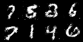
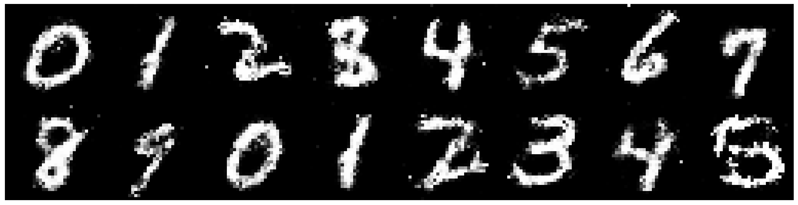

<div align="center">

# Pantheon Lab Programming Assignment

<a href="https://pytorch.org/get-started/locally/"></a>
<a href="https://pytorchlightning.ai/"></a>
<a href="https://hydra.cc/"></a>
<a href="https://github.com/ashleve/lightning-hydra-template"></a><br>

</div>
## My Solution to the asked questions:

* What is the role of the discriminator in a GAN model? Use this project's discriminator as an example.

The discriminator in a GAN model serves as a critic or a judge. It is trained to distinguish between real samples and fake samples generated by the generator. In this project, the discriminator is trained to give high validity score to real images and low score to those generated by the generator.

* The generator network in this code base takes two arguments: `noise` and `labels`.
What are these inputs and how could they be used at inference time to generate an image of the number 5?

The noise is a random vectore that is needed to serve as the seed for the generating images. The label provides the class information of the paritcular image. To generate image of 5, we will have to input a random noise vector and the label for number 5 into the generator.

* What steps are needed to deploy a model into production?

To deploy the model into production, the following steps are needed:
1. Model Preparation: This involves training the model on a sufficiently large and representative dataset, evaluating its performance on the test set, and optimizing it for inference speed and memory footprint.
2. Model Frontend Development: An interface to the model needs to be prepared, for instance, in the form of REST API etc.
3. Monitoring & Updating: Once deployed, there is a need for constant monitoring of the model to detect any performance issues and retrain as needed.

* If you wanted to train with multiple GPUs, 
what can you do in pytorch lightning to make sure data is allocated to the correct GPU? 

With pytorch Lightning, we can specify the number of gpus to be used in the Trainer class, and the module will automatically distribute the data across the available GPUs for us.

## Model Generated Images


## Chatbot Assignment Solution

* Compare atleast 3 different models and provide insights on Content Quality, Contextual Understanding, Language Fluency and Ethical Considerations with examples.

1. CohereForAI/c4ai-command-r-plus: Cohere is a language model developed by CohereForAI. It’s designed to understand and generate human-like text. It’s particularly useful for tasks that require understanding of context and generating coherent responses. However, like other language models, it may sometimes generate content that is biased or ethically questionable.
2. google/gemma-1.1-7b-it: Gemma is a language model developed by Google. It’s known for its ability to understand the context of words in a sentence and generate high-quality content. However, it’s not as fluent in generating text as some other models like GPT-3.
3. microsoft/Phi-3-mini4k-instruct: Phi is a language model developed by Microsoft. It’s designed to generate human-like text and is particularly useful for tasks that require a deep understanding of context. However, like other models, it may sometimes produce biased or ethically questionable outputs.

* What are the parameters that can be used to control response. Explain in detail.

Temperature: This controls the randomness of the model’s output. A higher value makes the output more random, while a lower value makes it more deterministic.
Repetition penalty: This helps to avoid repeating responses by setting a high value for this field.
Top-k Sampling: This sampling strategy only considers the top k probabilities for the next word.
Top-p Sampling (Nucleus Sampling): This sampling strategy chooses from the smallest set of top tokens whose cumulative probability exceeds a certain threshold.

* Explore various techniques used in prompt engineering, such as template-based prompts, rule-based prompts, and machine learning-based prompts and provide what are the challenges and considerations in designing effective prompts with examples.

1. Template-based Prompts: These are predefined structures where certain parts are filled in based on the context. They’re easy to use but lack flexibility.
2. Rule-based Prompts: These prompts use specific rules to guide the generation process. They offer more control but can be complex to implement.
3. Machine Learning-based Prompts: These prompts use machine learning models to generate prompts. They can adapt to different contexts but require substantial computational resources.
4. Designing effective prompts is challenging because it requires a deep understanding of both the task at hand and the model’s behavior. The prompt should be clear, concise, and guide the model towards the desired output.

* What is retrieval-augmented generation(RAG) and how is it applied in natural language generation tasks?

RAG combines the benefits of retrieval-based models and generative models. It uses a retriever to fetch relevant documents from a knowledge source and a generator to produce a response based on the retrieved documents. This approach is useful in tasks where the model needs external knowledge, such as question answering or fact-based dialogue.

## What is all this?
This "programming assignment" is really just a way to get you used to
some of the tools we use every day at Pantheon to help with our research.

There are 4 fundamental areas that this small task will have you cover:

1. Getting familiar with training models using [pytorch-lightning](https://pytorch-lightning.readthedocs.io/en/latest/starter/new-project.html)

2. Using the [Hydra](https://hydra.cc/) framework

3. Logging and reporting your experiments on [weights and biases](https://wandb.ai/site)

4. Showing some basic machine learning knowledge

## What's the task?
The actual machine learning task you'll be doing is fairly simple! 
You will be using a very simple GAN to generate fake
[MNIST](https://pytorch.org/vision/stable/datasets.html#mnist) images.

We don't excpect you to have access to any GPU's. As mentioned earlier this is just a task
to get you familiar with the tools listed above, but don't hesitate to improve the model
as much as you can!

## What you need to do

To understand how this framework works have a look at `src/train.py`. 
Hydra first tries to initialise various pytorch lightning components: 
the trainer, model, datamodule, callbacks and the logger.

To make the model train you will need to do a few things:

- [ ] Complete the model yaml config (`model/mnist_gan_model.yaml`)
- [ ] Complete the implementation of the model's `step` method
- [ ] Implement logging functionality to view loss curves 
and predicted samples during training, using the pytorch lightning
callback method `on_epoch_end` (use [wandb](https://wandb.ai/site)!) 
- [ ] Answer some questions about the code (see the bottom of this README)

**All implementation tasks in the code are marked with** `TODO`

Don't feel limited to these tasks above! Feel free to improve on various parts of the model

For example, training the model for around 20 epochs will give you results like this:



## Getting started
After cloning this repo, install dependencies
```yaml
# [OPTIONAL] create conda environment
conda create --name pantheon-py38 python=3.8
conda activate pantheon-py38

# install requirements
pip install -r requirements.txt
```

Train model with experiment configuration
```yaml
# default
python run.py experiment=train_mnist_gan.yaml

# train on CPU
python run.py experiment=train_mnist_gan.yaml trainer.gpus=0

# train on GPU
python run.py experiment=train_mnist_gan.yaml trainer.gpus=1
```

You can override any parameter from command line like this
```yaml
python run.py experiment=train_mnist_gan.yaml trainer.max_epochs=20 datamodule.batch_size=32
```

The current state of the code will fail at
`src/models/mnist_gan_model.py, line 29, in configure_optimizers`
This is because the generator and discriminator are currently assigned `null`
in `model/mnist_gan_model.yaml`. This is your first task in the "What you need to do" 
section.

## Open-Ended tasks (Bonus for junior candidates, expected for senior candidates)

Staying within the given Hydra - Pytorch-lightning - Wandb framework, show off your skills and creativity by extending the existing model, or even setting up a new one with completely different training goals/strategy. Here are a few potential ideas:

- **Implement your own networks**: you are free to choose what you deem most appropriate, but we recommend using CNN and their variants if you are keeping the image-based GANs as the model to train
- **Use a more complex dataset**: ideally introducing color, and higher resolution
- **Introduce new losses, or different training regimens**
- **Add more plugins/dependecy**: on top of the provided framework
- **Train a completely different model**: this may be especially relevant to you if your existing expertise is not centered in image-based GANs. You may want to re-create a toy sample related to your past research. Do remember to still use the provided framework.

## Questions

Try to prepare some short answers to the following questions below for discussion in the interview.

* What is the role of the discriminator in a GAN model? Use this project's discriminator as an example.

* The generator network in this code base takes two arguments: `noise` and `labels`.
What are these inputs and how could they be used at inference time to generate an image of the number 5?

* What steps are needed to deploy a model into production?

* If you wanted to train with multiple GPUs, 
what can you do in pytorch lightning to make sure data is allocated to the correct GPU? 

## Submission

- Using git, keep the existing git history and add your code contribution on top of it. Follow git best practices as you see fit. We appreciate readability in the commits
- Add a section at the top of this README, containing your answers to the questions, as well as the output `wandb` graphs and images resulting from your training run. You are also invited to talk about difficulties you encountered and how you overcame them
- Link to your git repository in your email reply and share it with us/make it public

# Chatbot Assignment:

To complete this assignment, you are required to create assistants in [HuggingChat](https://huggingface.co/chat/settings/assistants/new) and address the following questions:

* Compare atleast 3 different models and provide insights on Content Quality, Contextual Understanding, Language Fluency and Ethical Considerations with examples.

* What are the parameters that can be used to control response. Explain in detail.

* Explore various techniques used in prompt engineering, such as template-based prompts, rule-based prompts, and machine learning-based prompts and provide what are the challenges and considerations in designing effective prompts with examples.

* What is retrieval-augmented generation(RAG) and how is it applied in natural language generation tasks?

<br>
